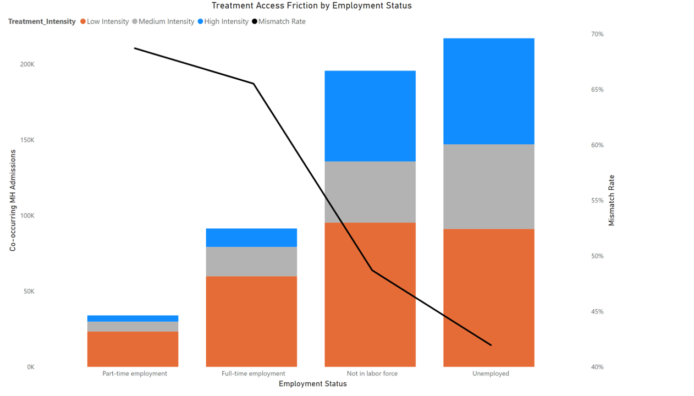
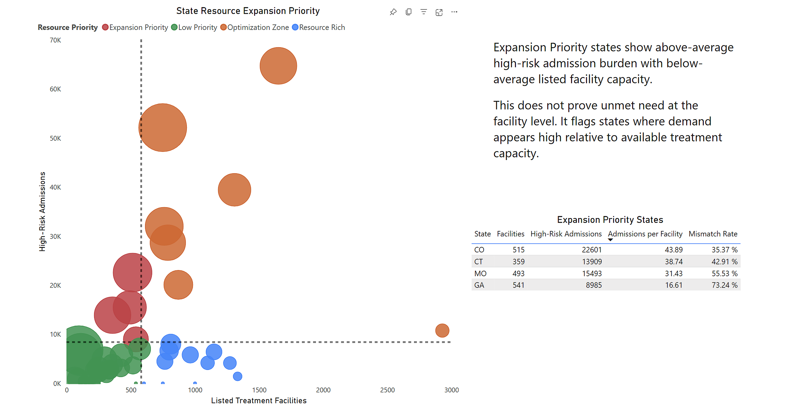

# Behavioral Health Resource Allocation Analysis

### Investigating treatment access patterns and operationalizing findings with Microsoft Fabric and Power BI

---

## Overview

This project investigates whether access to behavioral health treatment differs across employment groups among admissions with co-occurring mental health needs.

The core business question is whether some patient groups are more likely to receive low-intensity treatment even when their admission profile suggests a need for additional operational review. The analysis found that employed patients, especially part-time employed patients, had the highest Treatment Mismatch Rates.

I then extended the analysis into a reusable Microsoft Fabric data product that converts public SAMHSA admissions and facility data into curated Gold tables, a Power BI dashboard, semantic model inputs, and SQL views for downstream analysis.

The analysis is descriptive, not causal. It identifies patterns that may warrant operational review, but it does not determine why those patterns occur.

---

## Architecture

```text
Raw public datasets
  |-- TEDS-A admissions CSV
  |-- N-SUMHSS facility CSV
        |
        v
Bronze Delta tables
        |
        v
Silver cleaned analytical tables
        |
        v
Gold KPI and aggregate tables
        |
        |-- Power BI dashboard
        |-- Fabric semantic model
        |-- SQL Analytics Endpoint views
```


The canvas above shows the orchestrated Fabric pipeline. The downstream serving layers are documented in the detailed Fabric pipeline write-up.

### Project Scale

| Component | Scale |
|---|---:|
| TEDS-A admissions processed | 1,625,833 |
| Statistical validation sample | 538,172 |
| Public datasets integrated | 2 |
| Pipeline activities | 4 |
| Serving layers | 3 |

---

## Dashboard

The Power BI dashboard examines treatment intensity among admissions with co-occurring mental health needs and compares Treatment Mismatch Rate by employment status.



The dashboard insight was then validated through a statistical notebook and operationalized through Microsoft Fabric Gold outputs.

Detailed validation: [Statistical Validation](docs/statistical-validation.md)

---

## Key Finding

Among admissions with a co-occurring mental health condition (`PSYPROB = 1`), Treatment Mismatch Rate was highest for employed patients.

| Employment Status | Treatment Mismatch Rate |
|---|---:|
| Part-time employed | 68.7% |
| Full-time employed | 65.5% |
| Not in labor force | 48.7% |
| Unemployed | 42.0% |

Statistical validation supported the dashboard finding:

- Chi-square testing found a statistically significant association between employment status and Treatment Mismatch.
- Logistic regression showed the association remained after adjusting for age, sex, race, state, and wait-time category.
- Sensitivity checks showed the pattern was not isolated to one age group, wait-time category, or small set of states.

This supports employment status as a meaningful access-context variable for operational monitoring. It does not prove that employment causes mismatch.

---

## Additional Resource Planning View

The project also includes a state-level resource priority framework that compares high-risk admission burden with listed behavioral health treatment facility availability.



This framework is intended for high-level resource review, not as proof of unmet need at the facility level.

---

## Tools

| Tool | Purpose |
|---|---|
| Microsoft Fabric Lakehouse | Store raw, cleaned, and curated Delta tables |
| Fabric Notebooks / PySpark | Data cleaning, feature engineering, validation, and Gold table generation |
| Fabric Data Pipeline | Orchestrate ingestion and transformation activities |
| Fabric Semantic Model | Reuse Gold tables and measures for reporting |
| SQL Analytics Endpoint | Publish department-facing query views |
| Power BI / DAX | Build dashboard visuals and KPI calculations |
| Python / scipy / statsmodels | Run chi-square testing, logistic regression, and odds-ratio interpretation |

---

## Documentation

- [Statistical Validation](docs/statistical-validation.md)
- [Power BI Dashboard Case Study](dashboards/powerbi-dashboard-case-study.md)
- [Fabric Pipeline Documentation](docs/fabric-pipeline.md)
- [State Resource Priority Framework](docs/resource-priority-framework.md)

---

## Interpretation Boundary

This project uses public administrative data for operational analytics. Treatment Mismatch is an operational monitoring proxy, not a clinical appropriateness judgment. The results describe associations and patterns that may warrant review; they do not establish causality or patient-level clinical need.
