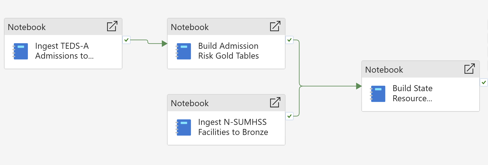
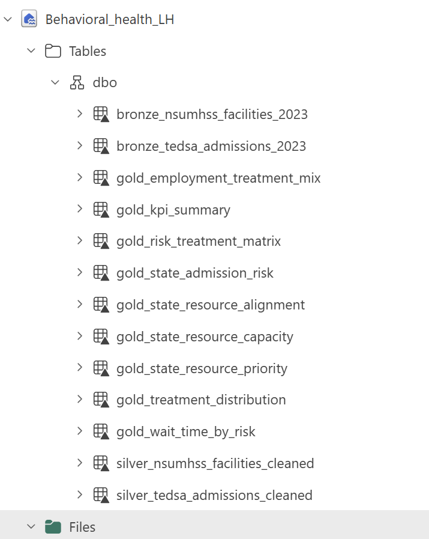
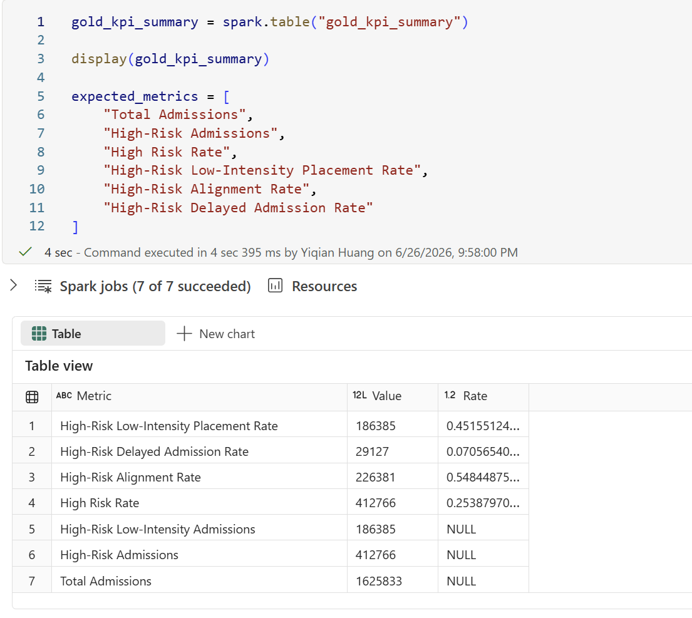
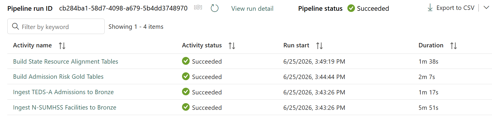
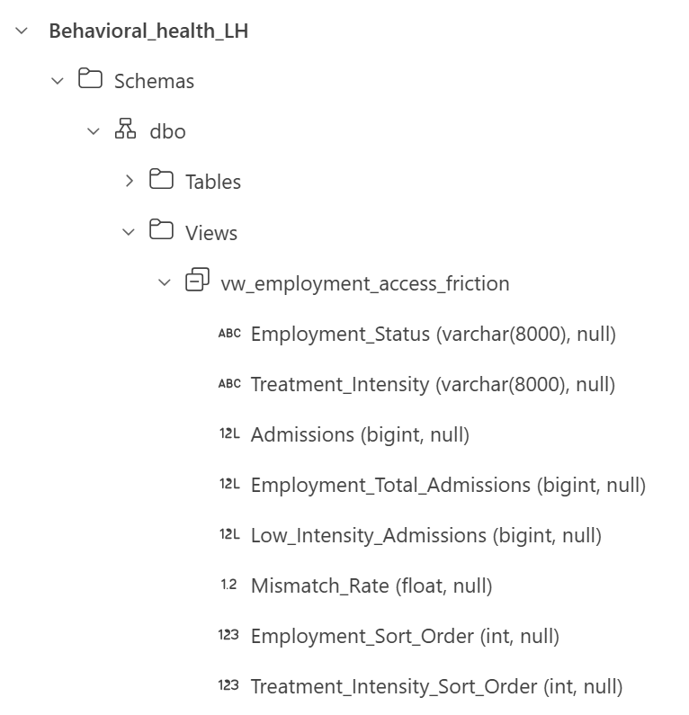
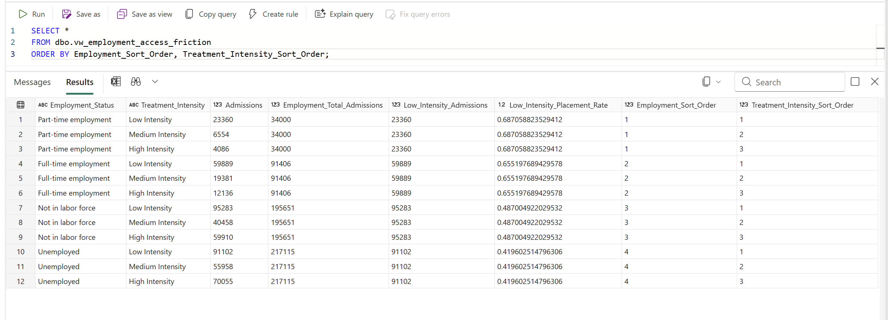
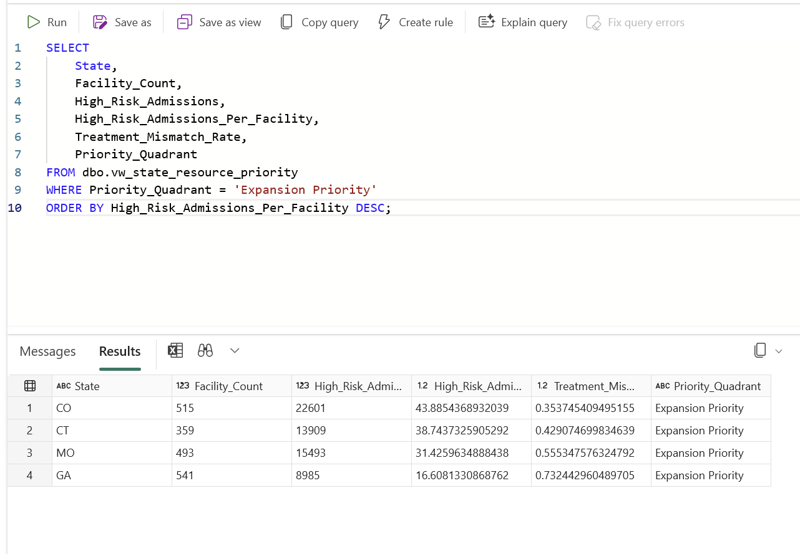
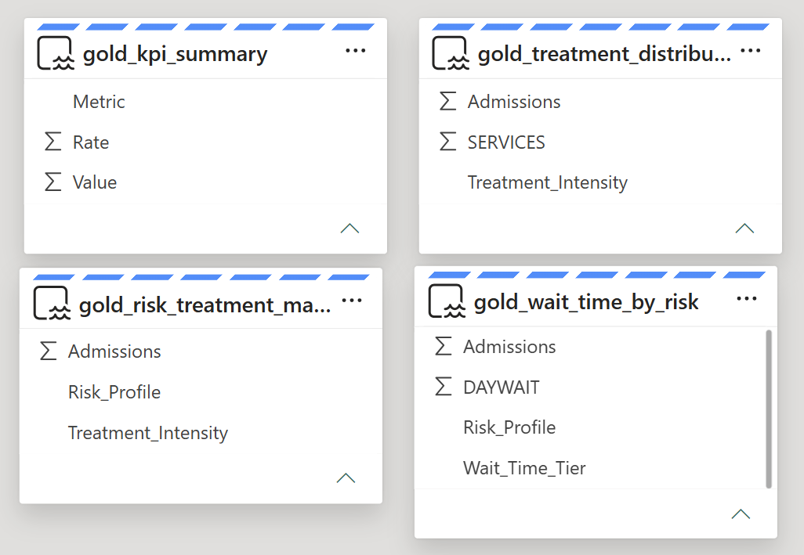

# Microsoft Fabric Pipeline Extension

This document explains how the Behavioral Health Resource Allocation analysis was extended into a Microsoft Fabric data pipeline.

The purpose of this pipeline is to turn raw behavioral health admissions and facility data into trusted, reusable, dashboard-ready KPI tables.

```text
Raw public CSV files in Lakehouse Files
-> Bronze Delta tables
-> Silver cleaned admissions and facility tables
-> Gold KPI and aggregate tables
-> Power BI dashboard, semantic model, and SQL views
```

---

## Business Purpose

Behavioral health teams need a repeatable way to monitor whether higher-risk admissions are being routed to care pathways that may warrant additional operational review.

A one-time dashboard can identify the issue, but a pipeline makes the analysis repeatable, auditable, and easier to refresh when new admissions data becomes available.

This pipeline supports three operational monitoring questions:

1. How many admissions are classified as high risk?
2. Are high-risk admissions routed to low-, medium-, or high-intensity care?
3. Which employment groups show the highest low-intensity placement rate?
4. Which states may need resource-availability review based on high-risk admissions and listed facility availability?

---

## Pipeline Design

The Fabric pipeline is organized as four notebook activities across two source-data branches:

```text
TEDS-A admissions CSV
-> Ingest TEDS-A Admissions to Bronze
-> Build Admission Risk Gold Tables

N-SUMHSS facility CSV
-> Ingest N-SUMHSS Facilities to Bronze
-> Build State Resource Alignment Tables
```

This separation is intentional. Admissions logic and facility-resource logic are maintained separately, while both branches publish reusable Gold outputs into the same Lakehouse.

The ingestion activities are responsible only for loading raw source files into managed Bronze Delta tables. The transformation activities use Bronze tables as stable sources for downstream cleaning, feature engineering, KPI generation, and state-level resource alignment.

Separating ingestion from transformation makes the pipeline easier to maintain because raw data loading, analytical business logic, and resource-priority logic do not always need to change together.



---

## When to Run Each Step

| Scenario | Rerun Bronze Ingestion | Rerun Gold Transformations |
|---|---:|---:|
| Source CSV file changed | Yes | Yes |
| New records were added to the raw CSV | Yes | Yes |
| Bronze table is already updated | No | Yes |
| Risk segmentation logic changed | No | Yes |
| Treatment intensity mapping changed | No | Yes |
| Employment access KPI logic changed | No | Yes |
| State resource priority logic changed | No | Yes |
| New KPI or Gold table added | No | Yes |
| Dashboard layout changed only | No | No |

For example, if the 2023 admissions CSV or facility CSV is replaced with an updated source file, the relevant Bronze ingestion activity should be rerun because the raw source changed.

If the Bronze tables already contain the latest records and only the business logic changes, the pipeline can rerun the transformation notebooks from Bronze without reparsing the raw CSV files.

---

## Fabric Architecture

| Layer | Fabric Component | Purpose |
|---|---|---|
| Raw | Lakehouse Files | Stores the original SAMHSA TEDS-A admissions and N-SUMHSS facility CSV files |
| Bronze | Delta tables | Preserves raw admissions and facility data as managed tables |
| Silver | Spark Notebooks | Cleans coded fields and creates business-readable analytical features |
| Gold | Delta tables | Produces dashboard-ready KPI, employment access-friction, and state resource tables |
| Orchestration | Fabric Data Pipeline | Runs ingestion and transformation notebooks as repeatable activities |
| Semantic Layer | Fabric Semantic Model | Reuses Gold tables for Power BI reporting |
| SQL Access | SQL Analytics Endpoint Views | Publishes department-facing query views |
| Reporting | Power BI | Visualizes treatment alignment, employment access-friction, and resource-priority KPIs |

---

## Pipeline Stages

### Activity 1: Ingest TEDS-A Admissions to Bronze

The admissions ingestion notebook reads the raw SAMHSA TEDS-A 2023 CSV file from Lakehouse Files and writes it to a managed Bronze Delta table.

```text
Files/tedsa_puf_2023.csv
-> bronze_tedsa_admissions_2023
```

This step creates a stable raw-data table that downstream transformations can reuse.

Notebook implementation:

```text
notebooks/00_bronze_ingestion.ipynb
notebooks/00_bronze_ingestion.py
```

### Activity 2: Ingest N-SUMHSS Facilities to Bronze

The facility ingestion notebook reads the raw N-SUMHSS facility file and writes it to a managed Bronze Delta table.

```text
Files/nsumhss_facilities_2023.csv
-> bronze_nsumhss_facilities_2023
```

This step creates the facility-availability base used by the state resource-priority framework.

Notebook implementation:

```text
notebooks/00_bronze_ingestion.ipynb
notebooks/00_bronze_ingestion.py
```

### Activity 3: Build Admission Risk Gold Tables

The admissions transformation notebook reads from the TEDS-A Bronze Delta table and creates cleaned analytical outputs.

```text
bronze_tedsa_admissions_2023
-> silver_tedsa_admissions_cleaned
-> gold_kpi_summary
-> gold_employment_treatment_mix
-> gold_risk_treatment_matrix
-> gold_treatment_distribution
-> gold_wait_time_by_risk
```

This step applies business logic, creates risk, employment, wait-time, and treatment-intensity features, and generates dashboard-ready KPI tables.

### Activity 4: Build State Resource Alignment Tables

The resource transformation notebook reads from the cleaned admissions and facility tables and creates state-level resource planning outputs.

```text
silver_tedsa_admissions_cleaned
silver_nsumhss_facilities_cleaned
-> gold_state_admission_risk
-> gold_state_resource_capacity
-> gold_state_resource_alignment
-> gold_state_resource_priority
```

This step extends the same curated data product into resource-availability review by comparing high-risk admission burden with listed facility availability.

---

## Pipeline Output Tables

| Table | Purpose |
|---|---|
| `bronze_tedsa_admissions_2023` | Raw admissions data stored as a Delta table |
| `bronze_nsumhss_facilities_2023` | Raw facility data stored as a Delta table |
| `silver_tedsa_admissions_cleaned` | Cleaned admissions data with risk, wait-time, and treatment intensity fields |
| `silver_nsumhss_facilities_cleaned` | Cleaned facility table used for state-level facility-availability measures |
| `gold_kpi_summary` | Core KPI table for dashboard-level metrics |
| `gold_employment_treatment_mix` | Employment-level treatment mix and low-intensity placement rate table |
| `gold_risk_treatment_matrix` | Admissions by risk profile and treatment intensity |
| `gold_treatment_distribution` | Admissions by treatment category and intensity |
| `gold_wait_time_by_risk` | Wait-time distribution by risk profile |
| `gold_state_admission_risk` | State-level high-risk admission burden |
| `gold_state_resource_capacity` | State-level listed treatment facility availability |
| `gold_state_resource_alignment` | Combined state admission and facility measures |
| `gold_state_resource_priority` | State resource-priority classification for planning review |



---

## Spark Transformation Logic

The Spark transformation notebook creates the Silver layer by translating coded administrative fields into business-readable analytical fields.

Key transformations include:

- Mapping `PSYPROB` into co-occurring mental health status
- Mapping `EMPLOY` into employment status
- Mapping `DAYWAIT` into wait-time tiers
- Creating `Risk_Profile`
- Creating `Treatment_Intensity`
- Generating employment-level access-friction and treatment-mix tables
- Generating state-level resource-priority tables from admissions and facility data

---

## Pipeline Validation

The Gold KPI output was validated against the high-risk placement metrics produced by the transformation logic.

| KPI | Value |
|---|---:|
| Total Admissions | 1,625,833 |
| High-Risk Admissions | 412,766 |
| High Risk Rate | 25.39% |
| High-Risk Low-Intensity Admissions | 186,385 |
| High-Risk Low-Intensity Placement Rate | 45.16% |
| High-Risk Alignment Rate | 54.84% |
| High-Risk Delayed Admission Rate | 7.06% |



---

## Orchestration Result

The four-activity Fabric Data Pipeline completed successfully on Fabric F2 capacity.

| Pipeline Activity | Status | Duration |
|---|---|---:|
| Ingest TEDS-A Admissions to Bronze | Succeeded | 1m 17s |
| Ingest N-SUMHSS Facilities to Bronze | Succeeded | 5m 51s |
| Build Admission Risk Gold Tables | Succeeded | 2m 7s |
| Build State Resource Alignment Tables | Succeeded | 1m 38s |

This confirms that the pipeline can rebuild the Bronze, Silver, and Gold analytical layers through an orchestrated Fabric workflow.



---

## SQL Analytics Endpoint Views

The Gold tables are also exposed through SQL Analytics Endpoint views so other teams can query curated metrics without working directly with notebooks or raw files.

The SQL serving layer includes two department-facing views:

| View | Source Gold Table | Department-Facing Use |
|---|---|---|
| `vw_employment_access_friction` | `gold_employment_treatment_mix` | Monitor low-intensity placement rate by employment status |
| `vw_state_resource_priority` | `gold_state_resource_priority` | Review state-level resource priority classifications |

Detailed SQL view documentation: [SQL Analytics Endpoint Views](sql-analytics-views.md)

SQL implementation:

```text
notebooks/04_sql_views.sql
```

The SQL Endpoint shows both curated views under `dbo > Views`.



The employment access-friction view publishes the same employment-level treatment mix used in the dashboard and validation narrative.

The query result confirms that the view returns employment status, treatment intensity, admissions, low-intensity admissions, and low-intensity placement rate in a department-friendly table.



The state resource priority view exposes Expansion Priority states for resource planning review.



---

## Why This Matters

This pipeline establishes a reusable analytics lifecycle that moves raw admissions data into governed KPI tables.

Once the data is in Fabric, the output can support:

- Power BI dashboarding
- Operational KPI monitoring
- Scheduled refresh workflows
- SQL-based cross-department access to curated views
- Future integration with additional healthcare datasets
- Deeper analysis using facility, staffing, capacity, follow-up, or outcome tables

This makes the architecture useful beyond a single dashboard. The curated Gold tables can become a foundation for ongoing behavioral health operations analysis.

---

## Future Improvements

Potential next steps include:

- Parameterizing the source file path and admission year
- Adding row-count validation after each stage
- Adding data quality checks for missing or unknown coded values
- Scheduling the pipeline refresh
- Connecting additional operational tables, such as facility capacity, staffing, payer, or follow-up data
- Extending the semantic model with additional validated measures

### Semantic Model Inputs

The semantic model uses the Gold tables generated by the pipeline as reusable inputs for Power BI reporting.


