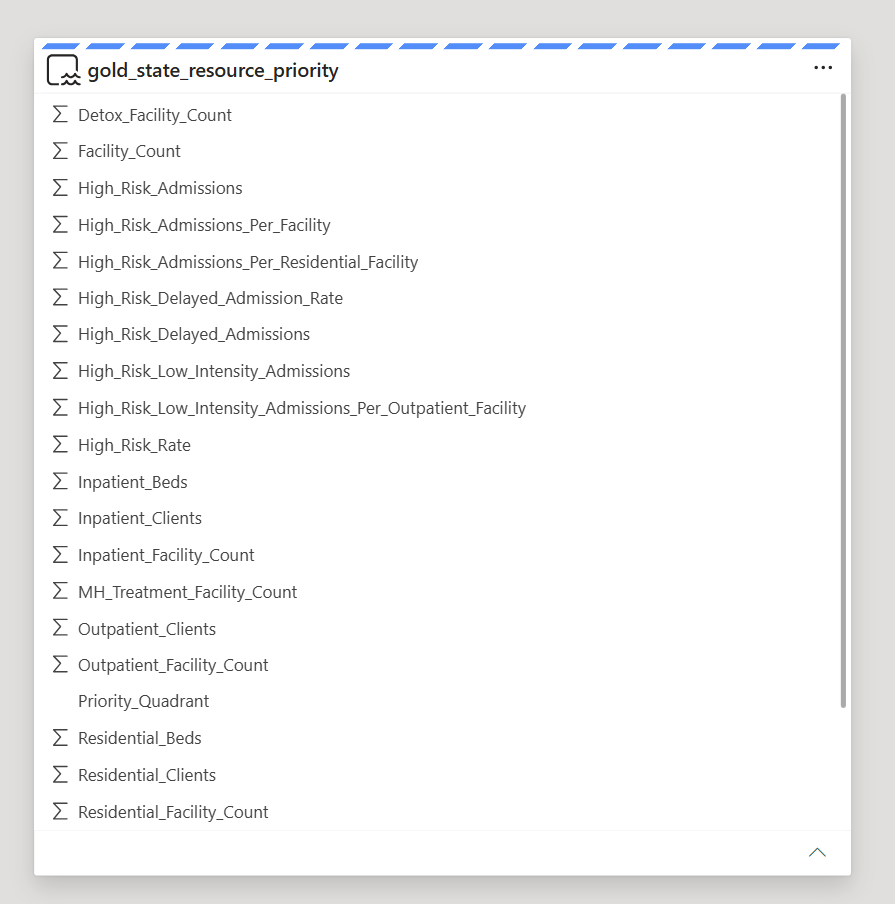

# State Resource Priority Framework

The final Gold table, `gold_state_resource_priority`, adds a `Priority_Quadrant` field to translate state-level admission burden and listed facility availability into a decision-ready resource planning view.

This framework combines two public behavioral health datasets:

- **TEDS-A 2023**: used to measure high-risk admission burden by state, where high risk refers to the project's operational review segment: co-occurring mental health needs plus unemployed or not-in-labor-force status
- **N-SUMHSS 2023**: used to measure listed treatment facility availability by state

## Priority Quadrant Inputs

The quadrant is built from two fields:

- **High_Risk_Admissions**: the number of admissions in the project's high-risk operational review segment reported by state
- **Facility_Count**: the number of listed N-SUMHSS treatment facilities by state

The quadrant thresholds use the average value across states:

- **Average Facility Count**: 582
- **Average High-Risk Admissions**: 8,424

These average-based thresholds are a simple planning heuristic. They make the portfolio dashboard easy to interpret, but they are not a formal resource-allocation model. A production version should test alternative thresholds such as percentiles, per-capita rates, bed or client capacity, utilization, travel distance, staffing, payer mix, and service modality.

## Priority Quadrant Logic

### Expansion Priority

Definition:

```text
High_Risk_Admissions >= 8,424
AND Facility_Count < 582
```

Business interpretation:

These states show above-average high-risk operational review admission burden with below-average listed facility availability. They are candidates for resource expansion review.

### Optimization Zone

Definition:

```text
High_Risk_Admissions >= 8,424
AND Facility_Count >= 582
```

Business interpretation:

These states show high-risk operational review admission burden, but also above-average listed facility availability. They may need resource optimization, service mix review, treatment intensity review, or referral pathway alignment rather than simple facility expansion.

### Low Priority

Definition:

```text
High_Risk_Admissions < 8,424
AND Facility_Count < 582
```

Business interpretation:

These states show lower high-risk operational review admission burden and below-average listed facility availability. They are lower immediate priority for expansion, but should still be monitored.

### Resource Rich

Definition:

```text
High_Risk_Admissions < 8,424
AND Facility_Count >= 582
```

Business interpretation:

These states show lower admission burden and above-average listed facility availability. They may have comparatively stronger resource availability, though utilization and service mix still require further review.

## Semantic Model

The resource priority report is built from the final Gold table, `gold_state_resource_priority`, exposed through a Fabric semantic model.



## Dashboard View


## Business Meaning

The quadrant view turns two separate public datasets into a state-level resource planning framework.

TEDS-A shows where the high-risk operational review admission segment is concentrated. N-SUMHSS shows where listed behavioral health treatment facilities are available. The joined Gold table compares a demand-pressure proxy against listed facility availability.

This helps stakeholders move beyond a flat state ranking and distinguish between different operational responses:

- **Expansion Priority** states may need additional facility availability or targeted resource review.
- **Optimization Zone** states may already have many facilities, but still experience high admission burden, suggesting the need to examine service mix, treatment intensity, referral pathways, or resource allocation.
- **Low Priority** and **Resource Rich** states provide context for monitoring and comparison.

In the current output, the dashboard flags **CO, CT, MO, and GA** as Expansion Priority states. These states show above-average high-risk operational review admission burden with below-average listed facility availability under the current average-threshold heuristic.

## Interpretation Boundary

This quadrant does **not** prove unmet need at the facility level.

It is a state-level planning proxy that identifies where high-risk operational review admission burden appears high relative to listed treatment facility availability. A real-world implementation should validate these findings with facility-level capacity, staffing, utilization, payer mix, geography, population size, travel distance, and clinical stakeholder input.
