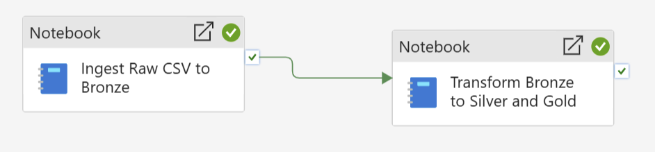
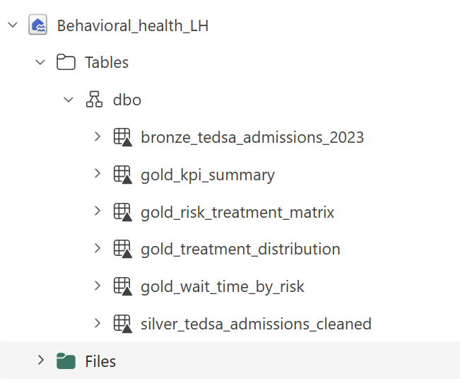
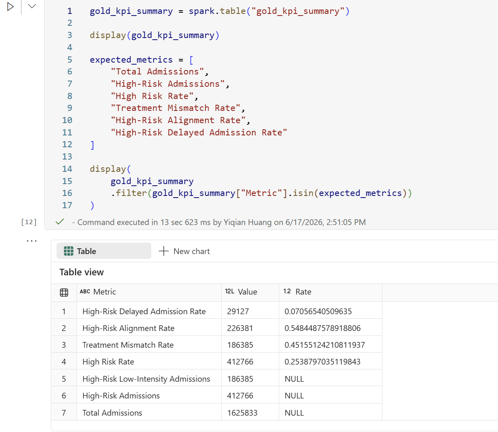
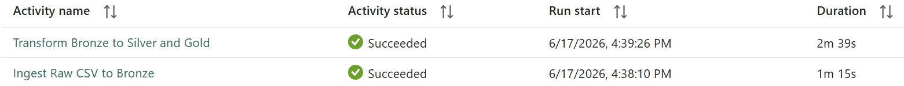
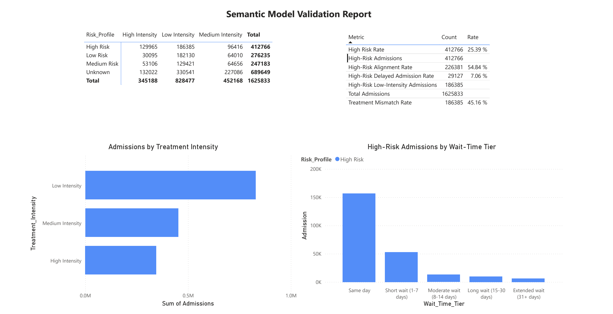

# Microsoft Fabric Pipeline Extension

This document explains how the Behavioral Health Risk-to-Treatment Alignment dashboard was extended into a Microsoft Fabric data pipeline.

The purpose of this pipeline is to turn raw behavioral health admissions data into trusted, reusable, dashboard-ready KPI tables.

```text
Raw CSV in Lakehouse Files
-> Bronze Delta table
-> Silver cleaned admissions table
-> Gold KPI and aggregate tables
-> Power BI dashboard
```

---

## Business Purpose

Behavioral health teams need a repeatable way to monitor whether higher-risk admissions are being routed to care pathways that match their operational risk profile.

A one-time dashboard can identify the issue, but a pipeline makes the analysis repeatable, auditable, and easier to refresh when new admissions data becomes available.

This pipeline supports three operational monitoring questions:

1. How many admissions are classified as high risk?
2. Are high-risk admissions routed to low-, medium-, or high-intensity care?
3. What share of high-risk admissions experience delayed admission exposure?

---

## Pipeline Design

The Fabric pipeline is separated into two sequential stages:

```text
Step 1: Ingest Raw CSV to Bronze
Step 2: Transform Bronze to Silver and Gold
```

This separation is intentional.

The ingestion step is responsible only for loading the raw source file into a managed Bronze Delta table. The transformation step uses the Bronze table as the stable source for all downstream cleaning, feature engineering, and KPI generation.

Separating these two steps makes the pipeline easier to maintain because raw data ingestion and analytical transformation do not always need to run together.



---

## When to Run Each Step

| Scenario | Run Step 1: Ingest Raw CSV to Bronze | Run Step 2: Transform Bronze to Silver and Gold |
|---|---:|---:|
| Source CSV file changed | Yes | Yes |
| New records were added to the raw CSV | Yes | Yes |
| Bronze table is already updated | No | Yes |
| Risk segmentation logic changed | No | Yes |
| Treatment intensity mapping changed | No | Yes |
| New KPI or Gold table added | No | Yes |
| Dashboard layout changed only | No | No |

For example, if the 2023 CSV originally contained only the first six months of admissions and later gets updated with the remaining six months, the ingestion step should be rerun because the source file changed.

If the Bronze table already contains the latest records and only the business logic changes, the pipeline can rerun the transformation step from Bronze without reparsing the raw CSV.

---

## Fabric Architecture

| Layer | Fabric Component | Purpose |
|---|---|---|
| Raw | Lakehouse Files | Stores the original SAMHSA TEDS-A CSV file |
| Bronze | Delta table | Preserves the raw admissions data as a managed table |
| Silver | Spark Notebook | Cleans coded fields and creates business-readable features |
| Gold | Delta tables | Produces dashboard-ready KPI and aggregate tables |
| Orchestration | Fabric Data Pipeline | Runs ingestion and transformation notebooks in sequence |
| Reporting | Power BI | Visualizes treatment alignment and operational risk KPIs |

---

## Pipeline Stages

### Step 1: Ingest Raw CSV to Bronze

The ingestion notebook reads the raw SAMHSA TEDS-A 2023 CSV file from Lakehouse Files and writes it to a managed Bronze Delta table.

```text
Files/tedsa_puf_2023.csv
-> bronze_tedsa_admissions_2023
```

This step creates a stable raw-data table that downstream transformations can reuse.

The first ingestion activity completed successfully in approximately 1 minute on Fabric F2 capacity.

### Step 2: Transform Bronze to Silver and Gold

The transformation notebook reads from the Bronze Delta table and creates cleaned analytical outputs.

```text
bronze_tedsa_admissions_2023
-> silver_tedsa_admissions_cleaned
-> gold_kpi_summary
-> gold_risk_treatment_matrix
-> gold_treatment_distribution
-> gold_wait_time_by_risk
```

This step applies business logic, creates risk and treatment features, and generates dashboard-ready KPI tables.

---

## Pipeline Output Tables

| Table | Purpose |
|---|---|
| `bronze_tedsa_admissions_2023` | Raw admissions data stored as a Delta table |
| `silver_tedsa_admissions_cleaned` | Cleaned admissions data with risk, wait-time, and treatment intensity fields |
| `gold_kpi_summary` | Core KPI table for dashboard-level metrics |
| `gold_risk_treatment_matrix` | Admissions by risk profile and treatment intensity |
| `gold_treatment_distribution` | Admissions by treatment category and intensity |
| `gold_wait_time_by_risk` | Wait-time distribution by risk profile |



---

## Spark Transformation Logic

The Spark transformation notebook creates the Silver layer by translating coded administrative fields into business-readable analytical fields.

Key transformations include:

- Mapping `PSYPROB` into co-occurring mental health status
- Mapping `EMPLOY` into employment status
- Mapping `DAYWAIT` into wait-time tiers
- Creating `Risk_Profile`
- Creating `Treatment_Intensity`
- Generating Gold KPI tables for dashboard consumption

---

## Pipeline Validation

The Gold KPI output was validated against the dashboard-level metrics.

| KPI | Value |
|---|---:|
| Total Admissions | 1,625,833 |
| High-Risk Admissions | 412,766 |
| High Risk Rate | 25.39% |
| High-Risk Low-Intensity Admissions | 186,385 |
| Treatment Mismatch Rate | 45.16% |
| High-Risk Alignment Rate | 54.84% |
| High-Risk Delayed Admission Rate | 7.06% |



---

## Orchestration Result

The two-stage Fabric Data Pipeline completed successfully on Fabric F2 capacity.

| Pipeline Activity | Status | Duration |
|---|---|---:|
| Ingest Raw CSV to Bronze | Succeeded | 1m 15s |
| Transform Bronze to Silver and Gold | Succeeded | 2m 39s |

This confirms that the pipeline can rebuild the Bronze, Silver, and Gold analytical layers through an orchestrated Fabric workflow.



### Pipeline Run Screenshot

---

## Why This Matters

This pipeline establishes a reusable analytics lifecycle that moves raw admissions data into governed KPI tables.

Once the data is in Fabric, the output can support:

- Power BI dashboarding
- Operational KPI monitoring
- Scheduled refresh workflows
- Future integration with additional healthcare datasets
- Deeper analysis using facility, staffing, capacity, follow-up, or outcome tables

This makes the architecture useful beyond a single dashboard. The curated Gold tables can become a foundation for ongoing behavioral health operations analysis.

---

## Future Improvements

Potential next steps include:

- Parameterizing the source file path and admission year
- Adding row-count validation after each stage
- Adding data quality checks for missing or unknown coded values
- Scheduling the pipeline refresh
- Connecting additional operational tables, such as facility capacity, staffing, payer, or follow-up data
- Building a semantic model directly from the Gold tables

### Semantic Model Validation Report


